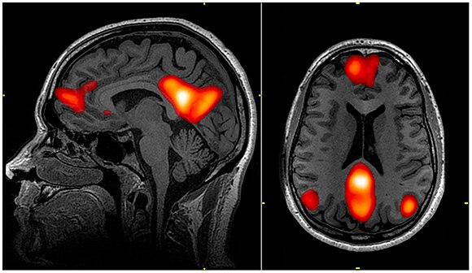

# blogs
#The 4 Networks of the Brain

Cognition, perception, and behavior are functions that are regulated throughout different parts of the brain. These functions can enable more complex tasks such as sensory perception, self-awareness, and even higher-level cognitive tasks such as metacognition (the ability to recall what one was thinking about a certain moment in time, based on a certain triggering stimulus). There are 7 total networks of the brain, but 3 of them pertain to the sensory perception of the nervous system, and the other 4 are relevant to the internal reactions and responses of the brain based on what is perceived by the other 3 sensory networks mentioned. These 4 networks are what we will discuss today. They are the **default mode network**, the **central executive network**, the **salience network**, and the **attention network**. These 4 networks go hand in hand in many aspects in order to facilitate many functions of the brain.

###The Default Mode Network (DMN)

The **default mode network** is responsible for the activity in the brain when a person is focused on their thoughts and inner functions. Such inner functions include daydreaming and reminiscing, as both functions are based on inner thoughts of a person rather than their reaction to environmental stimuli. The DMN is also active when the brain reacts mentally or psychologically, such as when a person thinks about other social interactions or relationships.

Above is an MRI scan of the brain when the DMN is active, from the National Institute of Health. During the activity of this network, the medial prefrontal cortex, the adjacent anterior cingulate cortex, the posterior cingulate cortex, and the angular gyrus are all active.

One may associate the DMN as the ‘inner voice.’ For example, the DMN is active to provide an inner commentary of the actions or behaviors that the brain endeavors. However, it is not directly involved in the cognitive analysis behind the goal-oriented tasks that the brain may pursue. It is only active to judge it.

###The Central Executive Network (CEN)

The goal-oriented tasks are directed by the **central executive network**. The CEN is responsible for the decisions made and the problems solved when the brain attempts to reach a goal. It can also used information in the working memory of the brain, which usually assists in the other two main functions statecd earlier. The CEN is active where the brain is cognitively and emotionally challenged.

The CEN is composed of the dorsolateral prefrontal cortex and the lateral posterior parietal cortex. The lateral posterior parietal cortex is responsible for gaining information from the five senses (external stimuli) and the internal perception (internal physiological stimuli) so that the dorsolateral prefrontal cortex can manipulate this information and weigh out different behavioral responses. The CEN can be though of as the source of our psychological stability, which is needed in order for it to make wise decisions, process, and regulate our emotions.

The prefrontal cortex is very important for the CEN because it is instrumental when the brain learns and processes. Learning is essentially composed of associations that are made, and the prfrontal cortex stores information through collections ofr neurons. These collections of neurons, also known as *cell assemblies*, are what make up memories. These memories, sometimes facts (semantic memories) and other times events (episodic memories) are forms of information that are manipulated by the dorsolateral prefrontal cortex in order to make decisions on how to react. What you did in the past in a certain situation can sometimes (but not always) affect how you react in the future.

###The Salience Network (SN)

The **salience network** is responsible for priortizing information in the brain. The information that it prioritizes is part of the brain’s cognitive system, which recieves information from stimuli both inside and outside the body that affect neurons. The human brain can receive up to 10 billion messages from its vast network of neurons, but the brain can only consciously process about 50 of those messages at the same time. As a result, it is important for the salience network to prioritize certain messages over others in order to make decisions on how to act.

The salience network is made up of many different parts. The anterior insulation is responsible for discrepancies of what we perceive (our stimuli,  basically). Then, it relays messages to other parts of the brain in order to elicit a proper response. The dorsal anterior cingulate gyrus processes the emotional discrepancies and discovers the emotional states that the brain faces when met with this stimuli. The left inferior frontal cortex receives information from the anterior insulation is responsible and the dorsal anterior cingulate gyrus to learn and make associations about the situation of the brain and the meaning of the stimuli. For example, it may be able to associate certain physicial feelings as pain or comfort, based on the physical touch and certain neurons’ perception of the touch; this information is received by the inferior frontal cortex. Finally, the amygdala decides whether these stimuli should be considered as threats to the neural system.

The function of the amygdala affects other parts of the brain. When the amygdala indicates that the brain is under threat, it releases adrenaline (epinephrine) while in a fight-or-flight response. This response triggers the CEN and the DMN to spiral out of control. This may happen again when the salience network erroneously labels another stimulus as unimportant, causing the amygdala to trigger a stress response, where the CEN and DMN (again) act erratically.

###The Attention Network (AN)

The **attention network** (as you might have guessed) is responsible for keeping us focused on a specific task. It includes various subnetworks in order to effectively maintain attention on the task at hand and avoid distractions. These subnetworks are the *dorsal attention network* and the *ventral attention network*.

The dorsal attention network (DAN) is responsible for maintaining the visual aspect of attention. In a sense, it shines a light on what the eyes should focus on. The intraparietal sulcus and the forntal eye fields assist in the visual factors that allow the brain to deploy attention to the desired task. It provides the visual stimuli necessary to the ventral attention network.

The ventral attention network (VAN) is responsible for taking in information provided by the DAN to react behaviorally. The stimuli that is provided by the DAN is scanned for simularities or peculiarities that are task-oriented, which then elicit the proper response. Structurally, the tempoparietal junction and the ventral frontal cortex are responsible for facilitating the proper attentive response at the target, while preventing distractions to occur from irrelevant stimuli.

The partnership between the DAN and VAN is very crucial. For example, let’s say you are flipping through your chemistry textbook for a specific formula that requires information about acids and bases (perhaps the Hendersen-Hasselbach formula). Your goal is to find the formula based on the information in the textbook. Your DAN will allow you to scan through your textbook to look for information related to acids and bases in order to find your formula. Your VAN will allow you to spot the formula and information you need, while rejecting any information that is irrelevent to your formula. In this case, you will need both attention subnetworks to reach your goal and avoid distractions.

###Teamwork of the 4 Networks

A basic description of the nervous system dwells on the perception of stimuli, message to the brain, message from the brain to another part of the body, and the physiological response ot the stimuli. The 4 networks of the brain that have been introduced so far facilitate these functions.

The attention network and the salience network work together to scan for relevant stimuli and attentively scan for threats and peculiarities. At the same time, any unnecessary stimuli, which are labelled by the salience network, is avoided by the attention network, preventing unnecessary distractions, The information collected by the attention and salience networks is forwarded to the DMN and the CEN. 

It is important to note that, as stated earlier, the DMN workes as an internal voice that judges the actions taken by the CEN. As a result, when the CEN is active, the DMN is idle. This allows the CEN to take full action and make the proper decisions based on the information of stimuli that is provided by the salience and attention networks. Everything that occurs here — detection of stimuli, response to stimuli — is regarded as an ‘event', in terms of the memory stored in the prefrontal cortex. After this event, when the CEN is idle and the DMN is active, it notes information about how the stimuli were handled and judgement of this event. This event is then saved as a memory (or cell assembly) by the medial prefrontal cortex, to ensure that future situations are handled similarly.

###Conclusion

The 4 networks of the brain described here are very crucial in perception, cognition, and behvaior associated with the stimuli that they assess and respond to. They are constantly active in your everyday life — from simple chores to complex challenges. Your brain, through these 4 networks, processes information that is later stored as you carry out your daily tasks. Even as you are reading this, your CEN and DMN work together to help process and store the information learned. That being said, I hope you keep investigating the wonders of the human brain and exercising your networks in the process!
